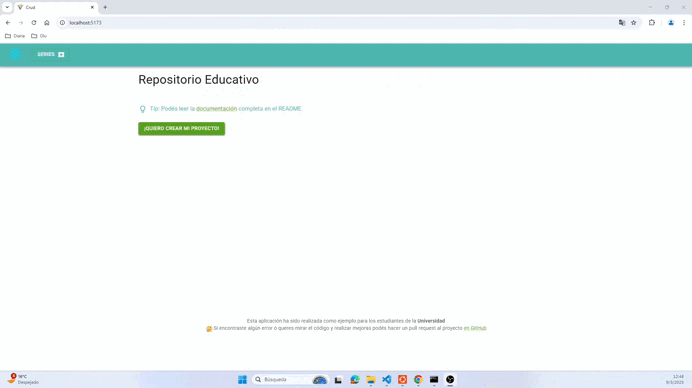

# Repositorio Educativo: aplicación React 🌱

¡Bienvenida/o! Este repositorio es una plantilla para crear una aplicación web con React. Esta aplicación ha sido realizada como ejemplo para que los estudiantes de la **Universidad** entiendan como se comunincan las aplicaciones front y back end. Las principales tecnologías que utilizamos son:

- [React](https://es.react.dev/): framework para construir interfaces de usuario.
- [Material](https://mui.com/material-ui/) UI: sistema de componentes visuales para React.
- [Formik](https://formik.org/): Es una librería que permite gestionar formularios de forma declarativa en React.
- [Axios](https://www.npmjs.com/package/axios): Es un cliente que permite realizar solicitudes HTTP basado en promesas que se puede ejecutar en el navegador

Para crear un proyecto siguiendo esta plantilla, lo único que tenés que hacer es clickear en el botón que dice **Use this template** de arriba a la derecha en la pagina de GitHub. ¡Y no te olvides de cambiarle el nombre en el package.json!

ℹ️ Este proyecto fue creado con [Vite](https://es.vite.dev/) con el comando npm `create vite@latest` seleccionado el framework React y la Variante TypeScript, y por lo tanto toda la documentación del sitio oficial también puede consultarse para saber más.

## :point_up: Prerrequisitos - para instalar antes de empezar

Vas a necesitar un IDE o al menos un editor de texto que coloree la sintaxis. Recomendamos utilizar Visual Studio Code - que se lleva muy bien con proyectos JavaScript - enriquecido con los siguientes plugins:

- [ESlint](https://marketplace.visualstudio.com/items?itemName=dbaeumer.vscode-eslint)
- [Prettier](https://marketplace.visualstudio.com/items?itemName=esbenp.prettier-vscode)
- [ES7+ React/Redux/React-Native snippets](https://marketplace.visualstudio.com/items?itemName=dsznajder.es7-react-js-snippets)

Para ejecutar el código es necesario tener [NodeJS](https://nodejs.org/es/download) en su versión 20.18.3 TLS ó superior. Podes consultar que versión tenes instalada corriendo el siguiente comando `node --version`. Para instalarlo recomendamos utilizar el manejador de versiones nvm, aunque también podés hacerlo manualmente siguiendo las instrucciones adecuadas para tu sistema operativo.

El ejemplo viene preparado para ser ejecutado junto a una API, que puede crearse desde este repositorio [Api Series V3](https://github.com/gonzager/api_series_v3)

## :ballot_box_with_check: Configuración inicial del proyecto

Asumiendo que ya configuraste todos los prerrequisitos, esté es el comando que deberías ejecutar la primera vez que trabajes en el proyecto:

```shell
# Instala las dependencias Node del proyecto.
npm install
```

Luego vas a tener que configurarla variable de entorno **VITE_API_URL** que se encuentra dentro de archivo **_.env_** reemplazando el valor a la derecha del igual con la URL de la api del back-end

```shell
## URL donde se encuentra la api
VITE_API_URL=http://localhost:4000
```

## :file_folder: Estructura de directorios

Breve descripción de qué se puede encontrar en cada uno de los directorios del proyecto:

```shell
├── public                  # archivos publics, imagenes, iconos, etc
└── src
    ├── components          # Componentes de React
        ├── iu              # Componentes comunes, header, NavBar, etc
        ├── series          # Componentes especifico para presetar las series
    └── state               # Manejo del estado global de las aplicacion
    └── utils               # Utilitarios que usa la aplicación
```

## :woman_technologist: :man_technologist: Comandos útiles para el día a día

A continuación, algunos comandos necesarios para el desarrollo diario en este proyecto.

### Código

```shell
# Levanta el proyecto y recarga automáticamente si hay cambios.
npm run dev

```

## :rocket: Demo


